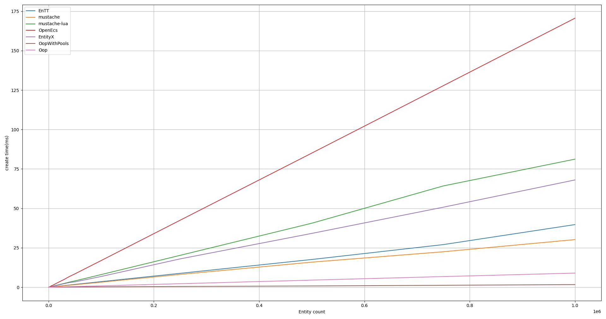
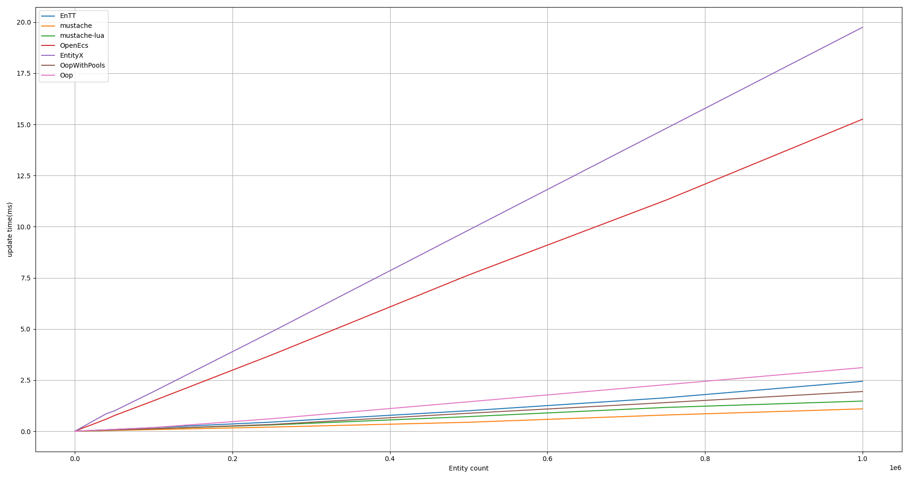
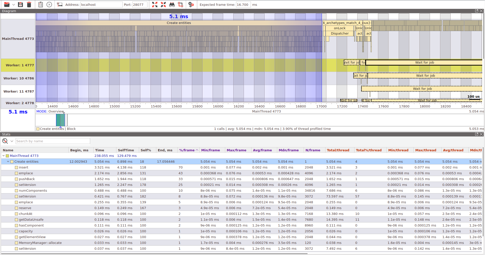

# mustache - A fast, modern C++ Entity Component System
[](https://github.com/kirillochnev/mustache/actions)
## Why mustache

* [Super fast component iteration](#Performance)
* [Multithreading support out of the box](#Multithreading)
* Fully runtime: you can describe Components and Systems without using templates
* Has C-API and can be used with other programing languages like ex: [mustache-lua](https://github.com/kirillochnev/mustache-lua)
* Has integration with [profiler](#Profiling)

## Introduction

The entity-component-system (also known as _ECS_) is an architectural pattern
used mostly in game development. For further details:

* [Entity Systems Wiki](http://entity-systems.wikidot.com/)
* [Evolve Your Hierarchy](http://cowboyprogramming.com/2007/01/05/evolve-your-heirachy/)
* [ECS on Wikipedia](https://en.wikipedia.org/wiki/Entity%E2%80%93component%E2%80%93system)
* [About ECS on github](https://github.com/SanderMertens/ecs-faq)
* [Telegram channel about ECS](https://t.me/ecscomrade)


## Code Example

```cpp
#include <mustache/ecs/ecs.hpp>

int main() {
    
    struct Position {
        float x, y, z;
    };
    struct Velocity {
        float x, y, z;
    };

    mustache::World world;
    for (uint32_t i = 0; i < 1000000; ++i) {
        (void) world.entities().create<Position, Velocity>();
    }

    const auto run_mode = mustache::JobRunMode::kCurrentThread; // or kParallel

    world.entities().forEach([](Position& pos, const Velocity& dir) {
        constexpr float dt = 1.0f / 60.0f;
        pos.x += dt * dir.x;
        pos.y += dt * dir.y;
        pos.z += dt * dir.z;
    }, run_mode);

    return 0;
}
```
## Requirements

To be able to use `mustache`, users must provide a full-featured compiler that
supports at least C++17.<br/>
The requirements below are mandatory to compile the tests:

* `CMake` version 3.7 or later.

## Overview

### Entities

An `mustache::Entity` is a class wrapping an opaque `uint64_t` value allocated by the `mustache::EntityManager`.

Each `mustache::Entity` has `id`(identifier of Entity), `version` (to check if Entity is still alive) and `worldId`.

Creating an entity is as simple as:

```cpp
#include <mustache/ecs/ecs.hpp>

mustache::World world;

const auto entity = world.entities().create();
```
And destroying an entity is done with:

```cpp
world.entities().destroy(entity); // to destroy while the next world.update()
world.entities().destroyNow(entity); // to destroy right now
```

### Components (entity data)

The general idea of ECS is to have as little logic in components as possible.

All logic should be contained in Systems.

But mustache has very weak requirements for struct / class to be component.

You must provide the next public methods (trivial or not):

* default constructor
* operator= 
* destructor

#### Creating components

As an example, position and direction information might be represented as:

```cpp
struct Position {
    float x, y, z;
};
struct Velocity {
    float x, y, z;
};
```
#### Assigning components to entities

To associate a Component with a previously created Entity call `world.entities().assign<C>(entity);` with the component type, and any component constructor arguments:

```cpp
// Assign a Position with x=1.0f, y=2.0f and z = 3.0f to "entity"
world.entities().assign<Position>(entity, 1.0f, 2.0f, 3.0f); 
```

There are two ways to create Entity with given set of the Components:

`world.entities().create<C0, C1, C2>(entity);`


```cpp
world.entities().begin()
    .assign<C0>(/*args to create component C0*/)
    .assign<C1>(/*args to create component C1*/)
    .assign<C2>(/*args to create component C2*/)
.end();
```

#### Component version control


You may wish to iterate over only changed components (see examples), for this reason mustache has built-in component version control system. 

Each type you query non-const component from entity, mustache updates component version.

Mustache groups components into blocks and track WorldVersion(int value, updates every `world.updte()`) for such blocks.  

You can change this block size by call `EntityManager::addChunkSizeFunction`, ex.

```cpp
world.entities().addChunkSizeFunction<Component0>(1, 32); // store version for every 1..32 instance of Component0
world.entities().addChunkSizeFunction<Component1>(1, 1); // store version for every instance of Component1
```

#### Component access 

To query component data from Entity you can call 
* `EntityManager::getComponent<C>(Entity);` to update component version and get mutable component
* `EntityManager::getComponent<const C>(Entity);`  to get cont component

In case of invalid entity or missed component nullptr will be returned.

#### Querying entities and their components

To query all entities with a set of components assigned you can use the next method.

```cpp
    world.entities().forEach([](Entity entity, Component0& required0, const Component1& required1, const Component2* not_required) {
        // Iterates over each entity with Component0 and Component1
        // updates version of Component0
        // not_required is ptr to  const Component2(if entity has such component) or nullptr.
    });
```

The other way is to use PerEntityJob, such job might be implemented with something like the following:
```cpp
struct MySuperJob : public PerEntityJob<MySuperJob> { 
    void operator()(const Component0&, Component1&) {
        // ...
    }

    ComponentIdMask checkMask() const noexcept override {
        // we want to update Component1 only if Component0 has changed.
        return ComponentFactory::makeMask<Component1>();
    }

    bool extraArchetypeFilterCheck(const Archetype& archetype) const noexcept override {
        const auto component_id = ComponentFactory::instance().registerComponent<Component2>();
        return !archetype.hasComponent(component_id); // skip entities with Component2
    }
};

MySuperJob job; // create instance of job

// call operator() for each entity with Component0, changed Component2 and without Component2
job.run(world); 

```

#### Multithreading
Mustache has builtin multithreading support, to run job in parallel mode, just use code like following:
```cpp
// run job parallel
job.run(world, JobRunMode::kParallel);

// run forEach parallel
world.entities().forEach(function, JobRunMode::kParallel);
```
#### Component dependencies
In the case where a component has dependencies on other components, a helper class exists that will automatically create these dependencies.

eg. The following will also add Component0 and Component1 components when a MainComponent component is added to an entity.

```cpp    
world.entities().addDependency<MainComponent, Component0, Component1>();
```

### Systems (implementing behavior)

Systems implement behavior using one or more components. Implementations are subclasses of System<T> and must implement the update() method, as shown below.

A basic movement system might be implemented with something like the following:
```cpp
struct System2 : public System<System2> {
    void onConfigure(mustache::World&, mustache::SystemConfig& config) override {
        config.update_after = {"System0", "System1"};
        config.update_before = {"System3"};
        config.priority = 0; // default priority
    }
    
    void onUpdate(mustache::World&) override {
        // run some jobs or do any other logic
    }
};
```


### Events (communicating between systems)

Events are objects emitted by systems, typically when some condition is met. Listeners subscribe to an event type and will receive a callback for each event object emitted. An ``mustache::EventManager`` coordinates subscription and delivery of events between subscribers and emitters. Typically subscribers will be other systems, but need not be.
Events are not part of the original ECS pattern, but they are an efficient alternative to component flags for sending infrequent data.

As an example, we might want to implement a very basic collision system using our ``Position`` data from above.

#### Creating event types

First, we define the event type, which for our example is simply the two entities that collided:

```c++
struct Collision {
  Entity left;
  Entity right;
};
```

#### Emitting events

Next we implement our collision system, which emits ``Collision`` objects via an ``mustache::EventManager`` instance whenever two entities collide.

```c++
class CollisionSystem : public System<CollisionSystem> {
protected:
    void onUpdate(mustache::World& world) override {
        world.entities().forEach([&](Entity first, const AABB& first_aabb){
            world.entities().forEach([&](Entity second, const AABB& second_aabb){
                if (collide(first_aabb, second_aabb)) {
                    world.events().post(Collision{first, second});
                }
            });
        });
    }
};
```

#### Subscribing to events

Objects interested in receiving collision information can subscribe to ``Collision`` events by first subclassing the class ``Receiver<_EventType>``:

```cpp
struct DebugSystem : public System<DebugSystem>, public Receiver<Collision> {
    void onConfigure(mustache::World&, mustache::SystemConfig& config) override {
        world.events().subscribe<Collision>(this);
        // you can use unsubscribe(); to stop getting events
    }
    void onEvent(const Collision &collision) {
        Logger{}.debug("entities collided: %d and %d", collision.first.id().toInt(), collision.second.id().toInt());
    }
};
```

You can also create subscriber by providing callback:
```cpp
// sub is a std::unique_ptr<Receiver<Collision> >, you can use sub.reset() to unsubscribe
auto sub = event_manager.subscribe<Collision>([](const Collision& event){
    // some logic
});

```

## Integration

You can use mustache in you projects by doing the following steps
1. Clone or copy sources into your project eg. `cd third_party && git submodule add https://github.com/kirillochnev/mustache.git`
2. Add mustache subdirectory with cmake `add_subdirectory(third_party/mustache)`
3. Link mustache to your project `target_link_libraries(${PROJECT_NAME} mustache)`

## Performance

The proposed entity-component system is incredibly fast to iterate entities and components, this is a fact. Some compilers make a lot of optimizations because of how mustache works, some others aren't that good. In general, if we consider real world cases, mustache is somewhere between a bit and much faster than many of the other solutions around, although I couldn't check them all for obvious reasons.

Let's make a little benchmark.

For this benchmark we will compare some ECS frameworks and classic OOP
* [mustache](https://github.com/kirillochnev/mustache)
* [mustache binding to LuaJit](https://github.com/kirillochnev/mustache-lua)
* [EnTT (using owning groups)](https://github.com/skypjack/entt)
* [EntityX](https://github.com/alecthomas/entityx)
* [OpenEcs](https://github.com/Gronis/OpenEcs)
* OOP
* OOP with object pool

We create entities with 2 components

```cpp
struct Position {
    glm::vec<3, int32_t> value {0, 0, 0};
};

struct Velocity {
    int32_t value { 1 };
};
```

And call the next function for them

```cpp
inline void updatePositionFunction(Position& position, const Velocity& velocity) {
    constexpr glm::vec<3, int32_t > forward {1, 1, 1};
    position.value += forward * velocity.value;
}
    
```

Create time:

_(lower is faster)_


Update time:

_(lower is faster)_

## Profiling

Mustache has integration with [EasyProfiler](https://github.com/yse/easy_profiler).
To enable profiling build mustache with cmake option `MUSTACHE_BUILD_WITH_EASY_PROFILER=ON`.
You can choose profile depth by set `MUSTACHE_PROFILER_LVL` to 0, 1, 2 or 3.

This profiling result of mustache unit-tests:

